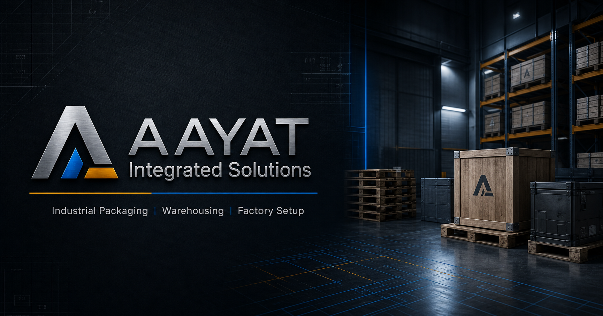

<div align="center">

# AAYAT Integrated Solutions Website

### Premium industrial business website for packaging, pallets, warehousing and factory solutions

<a href="https://satitech-admin.github.io/Aayat-integrated--solution-website/">
  
</a>

<br />
<br />

[](https://satitech-admin.github.io/Aayat-integrated--solution-website/)

**Click the image or button above to open the website.**

</div>

---

Premium JavaScript-only Next.js business website for **AAYAT Integrated Solutions**, covering industrial packaging, wooden pallets, warehousing systems, industrial real estate, waste management, and factory setup support.

## Features

- Responsive premium industrial UI with sticky header, mega menu, mobile menu, mobile CTA bar, and accessible focus states
- Interactive Three.js / React Three Fiber hero scene
- Framer Motion, GSAP ScrollTrigger, Lenis smooth scrolling, Swiper testimonials, and controlled microinteractions
- Full public route set: Home, About, Services, service pages, Industries, Projects, Certifications, Locations, Insights, Request a Quote, Contact, Privacy, Terms, 404, and error states
- Multi-step quote form with service-specific fields, file validation, honeypot, rate limiting, reference number, and WhatsApp handoff
- Contact and callback forms
- MongoDB/Mongoose models, Cloudinary upload hook, Resend/SMTP email hook, and local development fallback storage
- Protected admin dashboard with login, analytics cards, lead search/filtering, status updates, internal notes, and CSV export
- Sitemap, robots, metadata, Open Graph, Twitter cards, organization, local business, service, and FAQ schema

## Setup

```bash
npm install
cp .env.example .env.local
npm run dev
```

Local admin fallback code is `change-me-before-launch`. Set `ADMIN_ACCESS_CODE` and `ADMIN_SESSION_SECRET` before real use.

## Production

1. Create a MongoDB database and set `MONGODB_URI`.
2. Configure Cloudinary for requirement document uploads.
3. Configure either Resend or SMTP credentials for confirmation and notification emails.
4. Set `NEXT_PUBLIC_SITE_URL` to the production URL.
5. Replace all placeholders listed in `CONTENT_REPLACEMENT_GUIDE.md`.
6. Deploy to Vercel.

```bash
npm run build
npm run start
```

## Client Information Still Required

- Official logo/image file
- Verified office address and business hours
- Approved company profile PDF
- Certifications or memberships with proof
- Verified client logos and testimonials
- Real project case studies and media
- Real warehouse/property/investment opportunities
- Final social media links
- Blog article body copy and publishing dates
